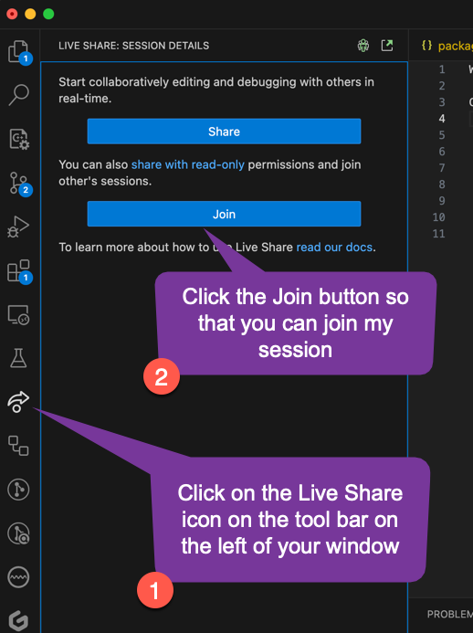
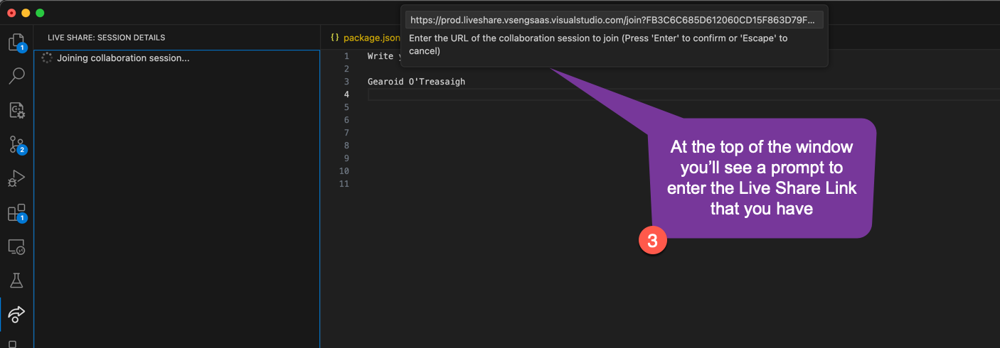

# Install VS Code (Visual Studio Code)

> Some participants may not have Visual Studio Code or Live Share installed.  This guides them through that process.  We use VS Code since it has the best Live Share capabilities as of February 2024.

You will make use of Visual Studio Code (VS Code).  This is an IDE (Integrated Development Environment), that allows us to have a rich development experience.  It can be downloaded from https://code.visualstudio.com/download.

## Pair Programming

While working in a coding dojo, it makes sense to pair-program.  To enable you to be able to pair-program seamlessly we'll use LiveShare which you can install into VSCode, which you can do by clicking on  https://marketplace.visualstudio.com/items?itemName=MS-vsliveshare.vsliveshare and then clicking the Install button and following the prompts to install onto VSCode.

Once you've finished setting up VS Code with Live Share, you should test it out by opening VS Code, opening the Live Share tab on the left, and choosing Share.

Get your colleague to connect to your Live Share, by sending them the Live Share link that was automatically copied to your clipboard.  Then get them to open VS Code, click on the Live Share tab on the left, and then choose join as shown below.

After they have clicked on Join, at the top of the window they'll see a prompt where they can paste in the link you shared with them.

You may be prompted to log in, and it's best to log in with GitHub or Microsoft so that you can be certain that you're connecting with the person that you expect to be.

Now that you've connected to the live share, try creating a new file and play around with the two of you editing it, so that you can see some of the features of Live Share.
